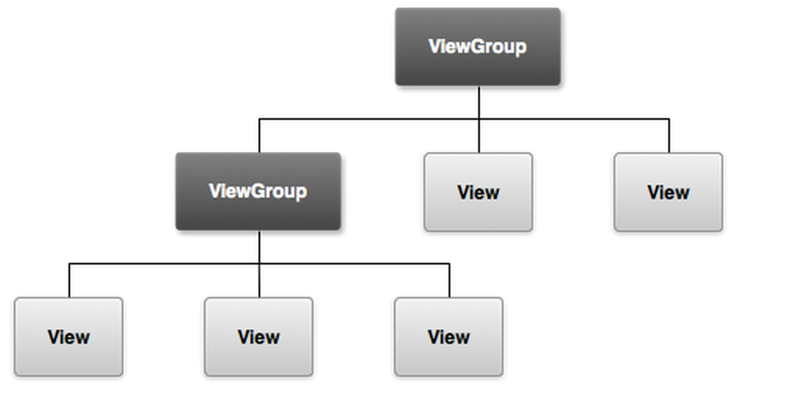

# Tuesday, September 5th: Course Introduction
* This course is many years in the making, since 2011
* Why (finally) disuss about mobile in a CS curriculum?  Mobile Development sounds very vocational:
	- Mobile is not going away: even in third-world countries, almost everyone has a mobile device
	- Mobile is very different environment than traditional PC
	- Writing software is very different than what you have been accustomed to
	- "Always on"
	- Constraints galore: battery and power, screen size, user interaction paradigm, memory, disk space, networking => you cannot take many elements for granted
	- Distribution model is very different that say deploying a website
	- New features to take advantage of including GPS, accelerometer, SMS, compass, NFC, camera
	- Networking: can you depend on it? Think 2G.
	- New security model and privacy issues
	- Mobile is not going away despite it is much harder to make money on a mobile platform now
	- Testing gets interesting especially with physical devices and fragmentation in Android (including carrier issues)
	- Policy issues in the news
	- Topics in Programming Languages, Operating Systems, Security and Privacy, Algorithms, Web, and Data Structures will constantly come up
	- Students have little exposure to the full-stack
	- If you do not understand mobile development, it will be very hard to understand issues such as mobile malware, forensics, privacy (or lack thereof) in mobile
	- To go through pain.  You are now at the mercy of corporations and things will change all the time.  There will be things you will do not understand and you have little control.
* What we will be using in this course: Android.  Baseline target of devices: Android 6.0 (Marshmellow).
* Why not iOS for this course?
* Q: Do we need an Android device for this course? A: No
* Assessment
	- Engineering notebook
	- Semester project
	- Tiny project
	- Your participation
* What you will need for the course:
	- Java
	- Android Studio
	- Node.js
* Let's start a simple app in Android Studio and pinpoint the big ideas and topics......
	- The reason why we are doing this: we have moved away from looking "under the hood."  So much is now abstracted in a CS curriculum.

# Thursday, September 7th: The Basics
* Last class: structure of an Android app
* The Android architecture: https://developer.android.com/guide/platform/index.html
* Android Runtime: Dalvik VM: https://source.android.com/devices/tech/dalvik/
* Components of an Android app:
	- Activity: a single screen, the user interface. While you can have multiple activities in an app, they are independent of each other!  This is what we are focusing on today
		- View: refers to the rectangular portion of screen; "container"
		- Best practice: one activity per screen
	- Service
	- Receiver
	- Intent
	- Content provider
* Activity lifecycle:
	- 
	- Documentation: https://developer.android.com/reference/android/app/Activity.html#ActivityLifecycle
* Going back to our starter Android app
* `AndroidManifest.xml` - Information about the app including components of the application, permissions, linked libraries, and minimum version of Android OS and API the app requires
* Android and Java documentation
* Basic Java review
* Designing a view and widgets
* Linking a view into an activity
* The Android `R` class: dynamically generated class, created during build process to dynamically identify all assets (from strings to android widgets to layouts), for usage in java classes in Android app.  More: http://stackoverflow.com/questions/6804053/understand-the-r-class-in-android.  DO NOT MANUALLY MODIFY THIS CLASS!
* Model View Controller (MVC) design pattern

# Tuesday, September 12th: The Toolchain
* Last class: a simple app with an activity, a view, widgets, some layouts, R
* A finer point about widgets, layouts: they are all views! Each component on the screen is either a View or ViewGroup!  The big idea: container
	-	
	- Source: https://stackoverflow.com/questions/27352476/difference-between-view-and-viewgroup-in-android
* Today: more basics, the tools
* `.apk` - the binary of the app.  Automatically generated for each app.  Believe it or not, it is just a ZIP file! http://stackoverflow.com/questions/3599210/view-content-of-apk-file.  Later in this course, we will discuss about reverse engineering an app
	- Flappy Bird
* Enabling "Developer Options" on an Android device => click on "Build Number" of your system 7 times.
* `adb`- Android Debug Bridge
	- `adb devices`
	- `adb install ...`
	- `adb push...` => upload a file from machine to device
	- `adb pull... => download a file from device to machine
	- `adb reboot`
	- `adb shell`
	- `adb logcat`
* `android` - Android SDK manager
* Managing Android simulators (`avd`)
	- `emulator`
	- How the Android simulator really works: virtual machine via `qemu`
* `ddms` - Dalvik Debug Monitor Server. https://developer.android.com/studio/profile/ddms.html
* `lint` - Lint tool for Android apps.  IMPORTANT for this class. https://developer.android.com/studio/write/lint.html
* `fastboot` -  Used to manipulate the flash partitions of the Android developer phone.  Used to install custom Android ROM (e.g., for rooting)
* `monkeyrunner` - https://developer.android.com/studio/test/monkeyrunner/index.html

# Thursday, September 21st: Android Security Model
* Very different model compared to Unix, PC
* The big ideas:
	- An app could take over your system
	- Limit power of installed software...
	- ...let programs to communicate or call each other
* Security fundamental 101: least privilege
* The application sandbox (by default)
	- "System assigns a unique user ID (UID) to each Android application and runs it as that user in a separate process."
	- "Applications cannot interact with each other and applications have limited access to the operating system."
* Least privilege-based permissions to protected APIs, system resources (e.g., camera, GPS, Internet)
	- Apps can only access a limited range of system resources by default
	- Permissions must be stated in `AndroidManifest.xml` file for app
		- List: https://developer.android.com/guide/topics/security/permissions.html
	- Permissions check on sensitive data and inputs including calendar and personal information (user grants access)
	- The very ugly: this system is prone to abuse. Read http://www.cs.tufts.edu/comp/116/archive/wrichard.pdf by Will Richard (former student in my Security class, from spring 2012)
* No Security Manager (legacy code), no Java Sandbox
* Can make system calls (via NDK)
* Apps can access the kernel, drivers, syscalls, etc. --if device is rooted
* Address Space Layout Randomization (ASLR) supported in Android 4.0
* Interprocess communications
	- Service: runs in background without blocking an activity or deter the user experience
	- Intent: asynchronous messaging system in Android; can be sent to your application or between applications. Messages are objects.
	- Broadcast Receiver: responds to system-wide announcements
	- Intents and list of broadcasts: https://developer.android.com/reference/android/content/Intent.html
* Reference: https://source.android.com/security/

# Thursday, September 28th: Networking, Services, Asynchronous Task, Geolocation
* To enable networking, first thing you need to do in your `AndroidManifest.xml` file is...?
* To make a networking call in Java, use built-in Java packages: `URL`, `HttpURLConnection`, etc.
* Threads
* But it is no longer that simple now.  You see, back in the good old days...
* A topic that is taught in COMP 20 and for many, it is hard to grasp...
* `AsyncTask` (since 2012): "This class allows you to perform background operations and publish results on the UI thread without having to manipulate threads and/or handlers."
	- Reference: https://developer.android.com/reference/android/os/AsyncTask.html
* Service: runs in background without blocking an activity or deter the user experience
* Reference: https://developer.android.com/training/location/index.html
* Two ways to do geolocation:
	- Google Play Services Location APIs
	- Android Framework Location APIs (`android.location`)
* The idea:
	1. Grant permissions in `AndroidManifest.xml`:
		- `<uses-permission android:name="android.permission.ACCESS_COARSE_LOCATION"/>`
   	 	- `<uses-permission android:name="android.permission.ACCESS_FINE_LOCATION"/>`
	2. Start a location manager: https://developer.android.com/reference/android/location/LocationManager.html
	3. Set up a location listener to list for location changes: https://developer.android.com/reference/android/location/LocationListener.html
	4. Check permissions to use geolocation'
	5. Request location updates
* Example app: `SimpleGeoApp`
* Reverse geolocation?

# Tuesday, October 31st: Production
* Preliminaries: Static vs dynamic analysis
* Preliminaries: public and private keys
* Preliminaries: code signing
	- The simple question: how do you trust what you are downloading, using?  How do you ensure the integrity and authenticity of the software?
	- Microsoft: https://msdn.microsoft.com/en-us/library/ms537361(v=vs.85).aspx
	- Apple: https://developer.apple.com/support/code-signing/. "Code signing your app assures users that it is from a known source and the app hasn’t been modified since it was last signed. Before your app can integrate app services, be installed on a device, or be submitted to the App Store, it must be signed with a certificate issued by Apple."
* Veracode static analysis: https://analysiscenter.veracode.com/
* Distribution model: iOS vs Android
	- Tradeoffs
* Google Play Developer Console: https://play.google.com/apps/publish/
* Before uploading your app (APK file) to Google Play, app must be signed. App signing: https://developer.android.com/studio/publish/app-signing.html
	- War story: don't lose your private key or keystore